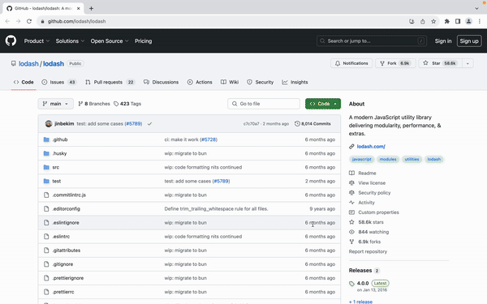

# Open Related Website

一款可以快速打开与当前页面相关网站的 Chrome 扩展。

## 🔧 安装

[link-chrome]: https://chromewebstore.google.com/detail/open-related-website/kgpcgldebjnldkgfiecjogencpiadpml 'Version published on Chrome Web Store'

[][link-chrome] [][link-chrome] 以及其它 Chromium 内核浏览器

## 🔍 使用说明

使用快捷键 `Alt + O` 打开搜索框，点击你想访问的网站即可。

你可以在 <chrome://extensions/shortcuts> 页面自定义快捷键

通过自定义规则你可以自定义网站推荐的相关网站，例如最近比较火的 DeepWiki，你可以使用自定义规则让任意 github 仓库可以推荐对应的 DeepWiki 页面。

[自定义规则 B 站视频教程](https://www.bilibili.com/video/BV13iL2zuEv2/)

## ❤️ 致谢

- [WXT](https://github.com/wxt-dev/wxt) - Web 扩展开发框架
- [GitHub-Web-IDE](https://github.com/zvizvi/GitHub-Web-IDE) - 提供了打开 GitHub 仓库 Web IDE 的创意
- [flaticon](https://www.flaticon.com/free-icon/neural_2103633?term=network&page=1&position=8&origin=search&related_id=2103633) - 提供了本扩展的图标
- [favicon-detector](https://github.com/BlackGlory/favicon-detector) - 简化了获取网站图标的过程
