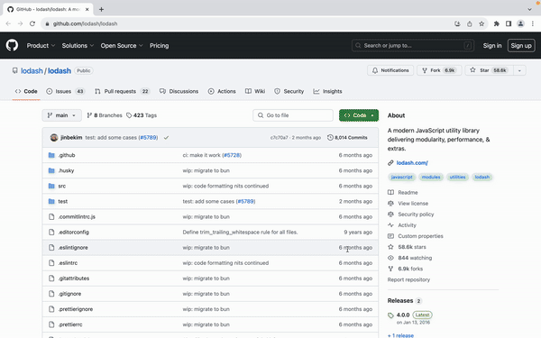

# Open Related Website

A Chrome extension that quickly opens websites related to the current page.

## 🔧 Installation

[link-chrome]: https://chromewebstore.google.com/detail/open-related-website/kgpcgldebjnldkgfiecjogencpiadpml 'Version published on Chrome Web Store'

[][link-chrome] [][link-chrome] and other Chromium-based browsers

## 🔍 Usage

Use the shortcut `Alt + O` to open the search box, then click on the website you want to visit.

You can customize the shortcut on the <chrome://extensions/shortcuts> page.

With custom rules, you can define related websites recommended for specific sites. For example, for the trending DeepWiki, you can create a custom rule that recommends the corresponding DeepWiki page for any GitHub repository.

[Custom Rules Video Tutorial (in Chinese)](https://www.bilibili.com/video/BV13iL2zuEv2/)

## ❤️ Acknowledgements

- [WXT](https://github.com/wxt-dev/wxt) - Web extension development framework
- [GitHub-Web-IDE](https://github.com/zvizvi/GitHub-Web-IDE) - Provided the idea of opening GitHub repositories in Web IDE
- [flaticon](https://www.flaticon.com/free-icon/neural_2103633?term=network&page=1&position=8&origin=search&related_id=2103633) - Provided the icon for this extension
- [favicon-detector](https://github.com/BlackGlory/favicon-detector) - Simplified the process of obtaining website icons
